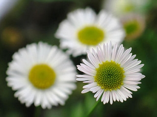

# 🌸 Flower Classification App 🌻

A simple **Streamlit web app** that classifies flower images into one of the following categories:  
**Daisy, Dandelion, Rose, Sunflower, Tulip.**

The app uses a **TensorFlow/Keras deep learning model** trained on a flower dataset.  

---

## 🚀 Features
- Upload a flower image (`.jpg`, `.jpeg`, `.png`)
- Get real-time predictions with confidence percentage
- Clean and modern UI with Streamlit
- Supports five flower classes

---

## 📸🌼🌺 Flower 



---

## ⚙️ Installation & Setup

1. Clone this repository:
   ```bash
   git clone https://github.com/your-username/flower-classification-app.git
   cd flower-classification-app

